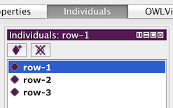
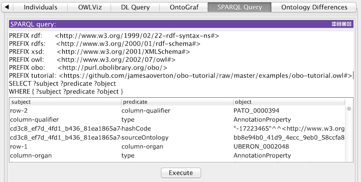

# Processing Data with Ontologies

In the [previous section](https://github.com/jamesaoverton/obo-tutorial/blob/master/docs/using-and-reusing.md) we built an application ontology with all the terms we need to support our [data-before.csv](https://github.com/jamesaoverton/obo-tutorial/blob/master/examples/data-before.csv). The next step is to transform that data into linked data formats that can be easily integrated with the application ontology.

## Tables to Triples

Ontologies are designed to support data sharing. There's a lot of scientific data in tables, such as spreadsheets and relational databases. But tables are hard to share. Even if we use IRIs as global names instead of local names, as we do in [data-after.csv](https://github.com/jamesaoverton/obo-tutorial/blob/master/examples/data-after.csv), there's still the rigid structure of columns to deal with -- you can't merge two tables until they have the same columns in the same order.

It's easier to share data if we have a more flexible data structure. Linked data standards use a very flexible data structure: graphs, in the sense of "networks". There are many other meanings for the word "graph" but here we mean a set of nodes connected by links, sometimes called vertices and edges. In a graph it's the connections between nodes that carry most of the information, and the order isn't important. When two graphs share some nodes, it's very easy to merge them into a single graph.

The [Resource Description Framework (RDF)](http://www.w3.org/RDF/) is the fundamental linked data standard for graphs. An RDF graph is build up from nodes and links between them. In RDF we call the first node the *subject*, the link the *predicate*, and the second node the *object*. The direction of the link is important! The subject is named with an IRI. The type of predicate is named with another IRI. And the object can be a node with an IRI or a *literal* with data such as a string or integer. Literals can have a data type, specified by an IRI. We call the whole thing a *triple*: subject-predicate-object. The predicate expresses some relationship between the subject and the object, so we can think of the triple as making a statement: subject A has relation B to object C.

In fact, you can see the same pattern in tables. The row usually specifies the subject, the column specifies the predicate, and the value of the cell where they intersect specifies the object. So a table is a collection of row-column-cell triples with a very compact shape. Tables work well when rows are very similar to each other, requiring the same columns, but graphs are more flexible.

RDF is the standard for linked data graphs. There are several different standards we can use for writing down an RDF graph in text or a computer file. I prefer [Turtle (Terse RDF Triple Language)](http://www.w3.org/TeamSubmission/turtle/). Here's an example:

    <http://example.org/ns/A> <http://example.org/ns/B> <http://example.org/ns/C> .

Notice the subject, predicate, and object, each of which is an IRI. The triple ends with a ".". This example is a little ugly and repetitive, but we can make it better using a CURIEs and defining a shared prefix:

    @prefix ex: <http://example.org/ns/> .
    ex:A ex:B ex:C .

This says the same thing in a much more readable way. We can make multiple statements about the same subject using semicolons to separate the parts:

    @prefix ex:  <http://example.org/ns/> .
    @prefix xsd: <http://www.w3.org/TR/xmlschema-2/> .
    ex:A ex:B ex:C ;
         ex:D "example" ;
         ex:E "1"^^xsd:integer .

Here we have one subject (`ex:A`), three predicates (`ex:B`, `ex:D`, and `ex:E`), and three objects (`ex:C`, "example", and "1"^^xsd:integer), making three statements about `ex:A`.

So IRIs are the building blocks and RDF gives us rules for putting them together into triples that combine to form a graph. Turtle is one good way to write RDF down (to *serialize* it). [SPARQL](http://www.w3.org/TR/rdf-sparql-query/) is the query language for RDF, in the same way that [SQL](http://en.wikipedia.org/wiki/SQL) is the standard query language for databases (i.e. collections of tables). [RDF Schema (RDFS)](http://www.w3.org/TR/rdf-schema/) and [OWL](http://en.wikipedia.org/wiki/Web_Ontology_Language) extend RDF to work well with ontologies, but at root it's all just triples. All these are [W3C](http://www.w3.org) standards designed for sharing data across the web. There are many open source and proprietary tools for working with linked data.

Switching from tables to triples makes data sharing easier, but there are some things to keep in mind. In a table there's an natural order to the rows and to the columns, but a graph doesn't have that sort of natural order. A graph is a set of nodes, and for each pair of nodes there is a set of links (maybe empty). The direction of the link matters, but the order of the nodes and the links doesn't matter. So don't be surprised if you create a Turtle file with the triples in an order that makes sense to you, then process the file with linked data software and find that the result is in an entirely different order.

Another important difference is the [open-world assumption](https://en.wikipedia.org/wiki/Open-world_assumption). Many programming languages and databases are built on the [closed-world assumption](https://en.wikipedia.org/wiki/Closed-world_assumption) that the system has comprehensive knowledge in its domain. For example, if a statement ABC is stored in the database then it is both known and true, but if ABC is not stored in the database then it is not known and assumed to be false. Linked data tools such as OWL do not make that assumption: if statement ABC is not known to be true, it could still be either true or false. This makes good sense when you're merging data across the internet, but it takes some getting used to.

## Converting Relational Data to RDF

Let's see how to convert our example data from table to triples. I like to do this in a few steps. The first step just does the basic translation from tables to triples -- row-column-cell to subject-precate-object and nothing more. These aren't very good triples. I call them "raw". But the raw triples are easy to work with and transform into better representations using standard linked data tools. The second step is to do exactly this, as we'll see in the next section.

For the raw conversion we'll use some Java code with the [Apache Jena]() library. We'll start with [data-after.csv](https://github.com/jamesaoverton/obo-tutorial/blob/master/examples/data-after.csv) and end with [data-raw.ttl](https://github.com/jamesaoverton/obo-tutorial/blob/master/examples/data-raw.ttl) (a Turtle file).

Turtle is human-readable if we have a good set prefixes to shorten our IRIs into CURIEs. One convenient way to define the prefixes is in another Turtle file: see [prefixes.ttl](https://github.com/jamesaoverton/obo-tutorial/blob/master/examples/prefixes.ttl).

The example code for the conversion is in [TripleConverter.java](https://github.com/jamesaoverton/obo-tutorial/blob/master/code/src/java/obo_tutorial/TripleConverter.java). If you follow the instructions in the [code/README.md](https://github.com/jamesaoverton/obo-tutorial/blob/master/code/README.md) file to build everything, you can run it using a command like this:

    cd examples
    java -jar ../bin/obo-tutorial.jar convert prefixes.ttl data-after.csv data-raw.ttl

Here's part of [data-raw.ttl](https://github.com/jamesaoverton/obo-tutorial/blob/master/examples/data-raw.ttl) for one row:

    study:row-1 a study:row ;
      study:column-datetime      "2014-01-01T10:21:00-0500" ;
      study:column-disease       obo:MPATH_268 ;
      study:column-group         study:group-1 ;
      study:column-investigator  <http://orcid.org/0000-0001-5139-5557> ;
      study:column-organ         obo:UBERON_0002048 ;
      study:column-protocol      obo:OBI_0600020 ;
      study:column-qualifier     obo:PATO_0000396 ;
      study:column-sex           obo:PATO_0000383 ;
      study:column-species       obo:NCBITaxon_10116 ;
      study:column-strain        study:F344N ;
      study:column-subject       study:subject-12 .

In the first line here `study:row-1 a study:row` means that `study:row-1` has `rdf:type` of `study:row` -- `a` is just a short form for `rdf:type`. As you can see, we have a statement for each cell, where the predicate is just the column. Most of the objects are CURIEs, but `datetime` is a literal string and `investigator` is a URI.

There are other ways to convert tables to triples. The W3C has a standard [R2RML: RDB to RDF Mapping Language](http://www.w3.org/TR/r2rml/) that has several [implementations](http://www.w3.org/2001/sw/rdb2rdf/wiki/Implementations). One powerful tool you can look into is [D2RQ](http://d2rq.org), a system for converting back and forth between relational databases and RDF. You can use D2RQ to keep your relational database but translate it to RDF on the fly, and query it using SPARQL instead of SQL. But for this sort of job you'll want to skip the raw triples and use better modelling, as we'll see below.

Next we'll see how to query over these triples using SPARQL, then use SPARQL to transform the triples into more interesting structures.

## Querying Instance Data with SPARQL

You can work with Turtle files in Protégé. By default, an RDF subject is assumed to be an OWL Individual (not an OWL Class), so you should look under the "Individuals" tab to find them. They also appear as "Members" of any class that they belong to in the "Classes" tab.

If you open [data-raw.ttl](https://github.com/jamesaoverton/obo-tutorial/blob/master/examples/data-raw.ttl) in Protégé and go to the "Individuals" tab you'll see our three rows. In the "Annotations" view you'll see all the predicates and objects we asserted.

The next thing to try is Protégé's "SPARQL Query" tab. If you've worked with relational databases you'll be familiar with [SQL](https://en.wikipedia.org/wiki/SQL), the Structured Query Language. SPARQL is the equivalent for RDF graphs. You'll see some familiar parts from SQL mixed with patterns from Turtle.

Like Turtle, SPARQL queries should start by declaring a set of prefixes that will make the rest of the syntax easier to read. Here are the prefixes we'll be using -- paste these into Protégé, replacing the prefixes it includes by default:

    PREFIX rdf:      <http://www.w3.org/1999/02/22-rdf-syntax-ns#>
    PREFIX rdfs:     <http://www.w3.org/2000/01/rdf-schema#>
    PREFIX xsd:      <http://www.w3.org/2001/XMLSchema#>
    PREFIX owl:      <http://www.w3.org/2002/07/owl#>
    PREFIX obo:      <http://purl.obolibrary.org/obo/>
    PREFIX tutorial: <https://github.com/jamesaoverton/obo-tutorial/raw/master/examples/obo-tutorial.owl#>

The simplest query we can do asks for all the triples. Paste this into Protégé below our prefixes, replacing the default query:

    SELECT ?subject ?predicate ?object
    WHERE { ?subject ?predicate ?object }

Click "Execute" at the bottom and you should see a lot of triples in the results table, including our rows and lots of other stuff.

Here's a more focused query for just the groups:

    SELECT ?group
    WHERE { ?subject tutorial:column-group ?group }

You should see three results (in any order): group-1, group-1, group-2. We can remove duplicates as we would in SQL:

    SELECT DISTINCT ?group
    WHERE { ?subject tutorial:column-group ?group }

We can also query for

    SELECT ?subject
    WHERE {
      ?subject
        tutorial:column-sex     obo:PATO_0000384 ;     # male
        tutorial:column-species obo:NCBITaxon_10116 .  # rat
    }

The `?subject` syntax means that we're querying for something to fit that slot in the WHERE pattern. The whole pattern inside the WHERE block has to be matched. So you should only get one result for this query: row-3.

We can also add our own "bindings" to the matched patterns with BIND:

    SELECT ?subject ?subject_label
    WHERE {
      ?subject
        tutorial:column-sex     obo:PATO_0000384 ;     # male
        tutorial:column-species obo:NCBITaxon_10116 .  # rat
      BIND ("foo" AS ?subject_label)
    }

To learn more SPARQL, try the [Jena SPARQL Tutorial](https://jena.apache.org/tutorials/sparql.html). Keep in mind that the implementation in Protégé is not as complete as Jena. For example, some SPARQL functions such as "CONCAT" don't seem to be supported.

## Modelling Instance Data

The raw triples we've been working with let us use linked data technologies such as RDF and SPARQL with our data, but so far they're just a crude translation of the table into triples. We can do better.

The key technology we're going to use is SPARQL Update. Just like SQL, you can use SPARQL to SELECT data, but it can also be used to INSERT data. To make this work we're going to use three RDF graphs:

1. the application ontology
2. the raw triples
3. the new model we're building

Just as SQL lets you query over multiple tables, SPARQL lets you query over multiple graphs. We use the GRAPH keyword to indicate which graph to use. How do we name our graphs? You guessed it: with IRIs. These are the names we'll use for the respective graphs:

1. tutorial:ontology
2. tutorial:raw
3. tutorial:data

Our SPARQL query uses the same prefixes as above. Instead of a SELECT block we have an INSERT block that basically uses Turtle syntax to specify the new data. Inside the WHERE block we have two GRAPH blocks: one to get data from the raw triples, and the other to get data from the application ontology. We also have a bunch of BIND statements to make some changes to the data before inserting it. Here's a simplified version:

    INSERT {
      GRAPH study:data {
        ?subject
          rdf:type        ?species ;
          rdfs:label      ?subject_label ;
        ?organ
          rdf:type        ?organ_type ;
          rdfs:label      ?organ_label ;
          obo:BFO_0000050 ?subject . # part of
      }
    }
    WHERE {
      GRAPH study:raw {
        ?subject_row
          study:column-subject ?subject ;
          study:column-species ?species ;
          study:column-organ   ?organ_type ;
      }
      GRAPH study:ontology {
        ?organ_type
          rdfs:label ?organ_type_label .
      }
      BIND (URI(CONCAT(STR(?subject), "-organ")) AS ?organ)
      BIND (CONCAT("subject ", REPLACE(STR(?subject), "^.*-", ""))
            AS ?subject_label)
      BIND (CONCAT(?subject_label, " ", ?organ_type_label)    AS ?organ_label)
    }

And here's some simplified output Turtle data with some comments for clarity:

    study:subject-31
      a               obo:NCBITaxon_10090 ;  # mouse
      rdfs:label      "subject 31" .
    study:subject-31-organ
      a                obo:UBERON_0007827 ;  # external nose
      rdfs:label       "subject 31 external nose" ;
      obo:BFO_0000050  study:subject-31 .    # part of

The upshot is that we use the statements about each `study:row` to make statements about the subject and its organ. We've finally broken out of the rigid structure of the table into a flexible graph structure. In this small example we state that the subject is an instance of the NCBI's taxon "Mus musclus", that the organ is an instance of Uberon's "external nose", and that the organ is part of the subject.

The [model.rq](https://github.com/jamesaoverton/obo-tutorial/blob/master/examples/model.rq) file contains a longer example of a SPARQL Update query -- longer, but still not capturing all the information in the original table. The results are in [data-after.ttl](https://github.com/jamesaoverton/obo-tutorial/blob/master/examples/data-after.ttl). If you open that file with Protégé it will import the application ontology and you can see all the data at once.

The example code is in [Modeller.java](https://github.com/jamesaoverton/obo-tutorial/blob/master/code/src/java/obo_tutorial/Modeller.java). If you follow the instructions in the [code/README.md](https://github.com/jamesaoverton/obo-tutorial/blob/master/code/README.md) file to build everything, you can run it using a command like this:

    cd examples
    java -jar ../bin/obo-tutorial.jar model data-raw.ttl application.owl model.rq data-after.ttl

Now we have the tools to build sophisticated linked data representations of our models. The example here is just that -- an example. It doesn't yet capture all the information in the table we started with. Building good models is hard work, requiring many decisions (large and small) specific to your application.

[TODO: Update the tutorial with more information about modelling instance data with OBO ontologies.]

During development it's usually convenient to have several files and use imports, but for a final version a single file is often better. I've created a single [obo-tutorial.owl](https://github.com/jamesaoverton/obo-tutorial/blob/master/examples/obo-tutorial.owl) file with both the application ontology and the

    cd examples
    java -jar ../bin/obo-tutorial.jar merge \
      data-after.ttl \
      obo-tutorial.owl \
      "https://github.com/jamesaoverton/obo-tutorial/raw/master/examples/obo-tutorial.owl"

## Querying Instance Data with DL Query

SPARQL can query any RDF data, and OWL is built on RDF, but SPARQL isn't always the best tool when using OWL. DL Query is specific to OWL and can take advantage of OWL's logical power.

TODO: Finish writing this section. In the meantime, here are some links to get you started:

- [translation from OWL to RDF](http://www.w3.org/TR/owl2-mapping-to-rdf/)
- [Manchester syntax for OWL](http://www.w3.org/TR/owl2-manchester-syntax/)
- [DLQuery in Protégé](http://protegewiki.stanford.edu/wiki/DLQueryTab)
- [DLQuery with OWLAPI examples](https://github.com/owlcs/owlapi/tree/version4/contract/src/test/java/uk/ac/manchester/owl/owlapi/tutorial/examples)
- [SPARQL-DL](http://www.derivo.de/en/resources/sparql-dl-api/) can combine the two

## Best Practises for Reasoning Over Large Data Sets

One of the biggest benefits of using OWL is the availability of automated reasoners:

- check for logical inconsistencies
- check that logical definitions can be satisfied
- infer new statements from existing ones

There's an art to balancing logical power with reasoner performance, which can take some trial and error.

WARNING: The current version of the application ontology should reason properly (and quickly) using Protégé 4 and ELK. I ran into errors using Protégé 5 with ELK. I have not been able to make HermiT work for the current version, probably because the Uberon module we extract is too large and complex.

TODO: Finish writing this section.

- [OWL 2 reasoning profiles](http://www.w3.org/TR/owl2-profiles/)
- [HermiT OWL reasoner](http://hermit-reasoner.com)
- [ELK OWL reasoner](https://code.google.com/p/elk-reasoner/) very fast for basic OWL reasoning

In the [final section](https://github.com/jamesaoverton/obo-tutorial/blob/master/docs/ontology-development.md) we'll see more about ontology development, such as requesting new terms, development workflows, and release processes.
